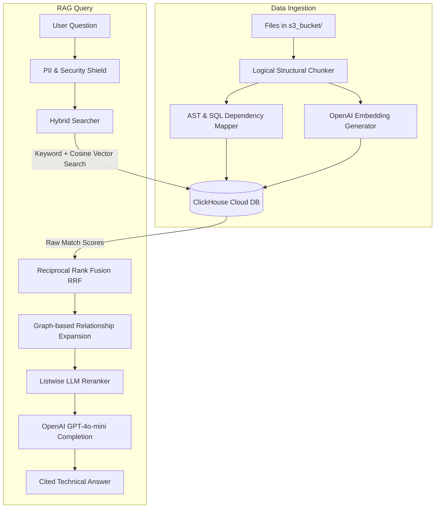

# 🔍 Enterprise Engineering Knowledge Assistant

An advanced, security-first **Retrieval-Augmented Generation (RAG)** search system for software engineering codebases, database schemas, and documentation. Powered by **ClickHouse Cloud** for high-dimensional vector search and semantic relationship traversal, and **OpenAI GPT-4o-mini** for low-latency intelligent context reasoning.

---

## 🌟 Core Features

- **Hybrid Search Engine**: Combines **Keyword Search** (ClickHouse's native string position search) and **Dense Vector Search** (using OpenAI `text-embedding-3-small` with ClickHouse's native `cosineDistance` calculation) via **Reciprocal Rank Fusion (RRF)**.
- **Dependency Knowledge Graph**: A custom Python AST, SQL, and Markdown crawler that automatically maps linkages between files (e.g., Python module imports, shared database tables, configuration mappings, doc references).
- **Graph Context Expansion**: At query-time, retrieves connected dependency code/documentation to provide complete context blocks for the LLM.
- **PII & Credential Shield**: Integrates regex-based scrubbing to automatically detect and redact API keys, emails, IPs, credentials, and custom identifiers before sending data to external APIs.
- **Speed & Efficiency**: Leveraging ClickHouse Cloud for vector matching means lightning-fast query times over the network and negligible local resource usage.

---

## 🏗️ Architecture & Data Flow



---

## 🛠️ Project Structure

```
├── .env                         # ClickHouse Cloud & OpenAI environment configurations
├── .gitignore                   # Ignore rules for credentials, SQLite, and venv files
├── app.py                       # Main Streamlit Frontend Dashboard
├── README.md                    # Project documentation (this file)
├── requirements.txt             # Python dependencies
├── s3_bucket/                   # Local staging folder simulating S3 directory
│   ├── configs/                 # JSON/YAML configurations
│   ├── docs/                    # Markdown architecture guides
│   ├── pdfs/                    # External manuals and PDF guides
│   ├── python/                  # Python source code files
│   └── sql/                     # Raw SQL analytics scripts and DDL
├── backend/
│   ├── ingestion/
│   │   ├── pipeline.py          # Document loader, chunker, and database uploader
│   │   └── relationship_mapper.py # Dependency and knowledge graph builder
│   ├── retrieval/
│   │   ├── database.py          # ClickHouse Cloud client schema definition and utilities
│   │   └── search.py            # Hybrid searcher, RRF scorer, and LLM prompt compiler
│   ├── services.py              # OpenAI API integrations (embeddings & chat)
│   └── security/
│       └── pii_shield.py        # PII & credential redaction layer
├── check_ch.py                  # Utility: Diagnostic ClickHouse Cloud connection tester
└── query_db.py                  # Utility: Diagnostic live database inspector
```

---

## 🚀 Setup & Installation

### 1. Prerequisites
Ensure you have **Python 3.10+** installed on your machine.

### 2. Clone and Setup Environment
```bash
# Clone the repository
git clone https://github.com/krishna-patil19/Enterprise-knowledge-assistant.git
cd Enterprise-knowledge-assistant

# Create and activate virtual environment
python -m venv .venv
source .venv/bin/activate       # On Linux/macOS
.venv\Scripts\activate          # On Windows
```

### 3. Install Dependencies
```bash
pip install -r requirements.txt
```

### 4. Configure Environment Variables
Create a file named `.env` in the root directory:
```env
OPENAI_API_KEY=your_openai_api_key_here

# ClickHouse Cloud Database Connections
CLICKHOUSE_HOST=your-clickhouse-cloud-endpoint.aws.clickhouse.cloud
CLICKHOUSE_PORT=8443
CLICKHOUSE_USER=default
CLICKHOUSE_PASSWORD=your_clickhouse_cloud_password_here
```

---

## ⚙️ Running the Application

### Step 1: Run Diagnostics (Optional)
Check that you can connect to ClickHouse Cloud:
```bash
python check_ch.py
```

### Step 2: Index the Base Files
Ingest files from the local `s3_bucket/` directory to ClickHouse Cloud:
```bash
python -m backend.ingestion.pipeline
```
*(You can also trigger a re-index directly from the Sidebar button in the Streamlit UI).*

### Step 3: Run the Streamlit Frontend UI
```bash
streamlit run app.py
```
Open [http://localhost:8501](http://localhost:8501) in your browser.

---

## 🩺 Monitoring the Database
You can query the live status and tables in your ClickHouse Cloud cluster directly from the command line:
```bash
python query_db.py
```
This utility outputs:
1. Lists of files currently indexed.
2. Summaries of chunk content previews.
3. Node relationship linkages.
4. Total statistics (count of files, chunks, vectors, and links).
